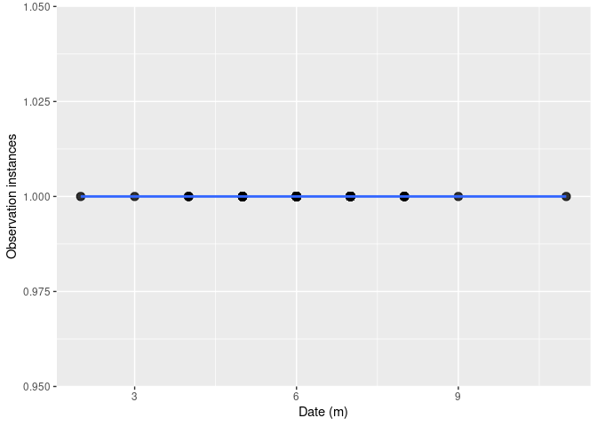

Final_Draft
================
Stephanie Wiegman
2025-10-30

\#ABSTRACT

\#BACKGROUND

\#QUESTIONS AND HYPOTHESIS

\##Question

\##Hypothesis

\##Prediction

\#METHODS

\##Figure 1: Scatterplot

``` r
data <- read.csv("UtahFireflies_Revised.csv")

ggplot(data, aes(x=Month, y=Instance)) + 
  geom_point(size=3, fill="black", alpha=.8) + 
  geom_smooth(method='lm') +
  xlab("Date (m)") + # X-axis label
  ylab("Observation instances") # Y-axis label
```

    ## `geom_smooth()` using formula = 'y ~ x'

<!-- -->

\##Figure 2

\#DISCUSSION

\#CONCLUSION

\#REFERENCES

Citizen Science Libraries. (n.d.). UtahFireflies. Google Docs. Retrieved
October 30, 2025, from
<https://docs.google.com/spreadsheets/d/1XLklQd6P3d9wYnmh-3KgzNvP8GfQHL2Y2IyaZMwIOzk/edit?usp=drive_web&ouid=106039106225729317949&usp=embed_facebook>
